background-image: url(https://www.childrensrights.ie/sites/default/files/PSI.jpg)
background-size: 150px
background-position: 90% 8%
layout: true
  
<div class="custom-footer"><span>Presented as part of the 2020 PSI Online Conference</span></div>

```{r setup, include = FALSE}
# general options --------------------------------------------------------------
options(scipen = 999)
set.seed(123)
# chunk options ----------------------------------------------------------------
knitr::opts_chunk$set(
  cache.extra = knitr::rand_seed, 
  message = FALSE, 
  warning = FALSE, 
  error = FALSE, 
  echo = FALSE,
  cache = FALSE,
  comment = "", 
  fig.align = "center", 
  fig.retina = 3
  )
# libraries --------------------------------------------------------------------
library(tidyverse)
library(knitr)
library(nomnoml)
library(fontawesome)

```

---

class: center, middle

# Disenchantment with Emotion Recognition Technologies: Implications and Future Directions

### Damien Dupré
### Dublin City University

---

# Why Measuring Emotions?

The emotional experience determines our perceptions and leads our decisions in every life (e.g., the Phineas Gage Case; see also [Bechara, Damasio, & Damasio, 2000](https://doi.org/10.1093/cercor/10.3.295))

```{r out.width = "50%"}
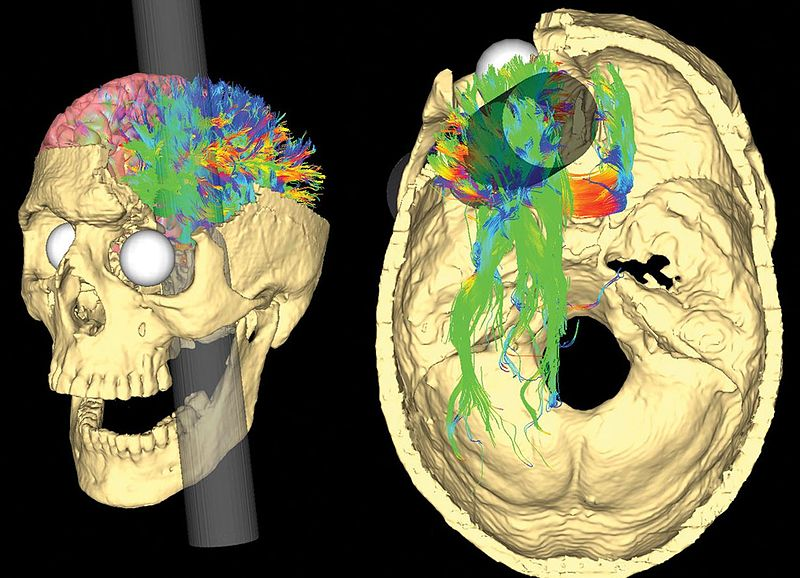
```
.center.tiny[Modeling the path of the tamping iron through the Gage skull and its effects on white matter structure.<br />Credit: Van Horn, Irimia, Torgerson, Chambers, Kikinis & Toga (2012) [`r emo::ji("link")`](https://doi.org/10.1371/journal.pone.0037454)]
---

# What Emotions are not?

Affective states refer to **"valenced (good versus bad) states"** ([Gross, 2010, p. 212](https://doi.org/10.1177/1754073910361982)):

* Attitudes are **relatively stable beliefs about the goodness or badness of something or someone**

* Moods are **less stable than attitudes**, and unlike attitudes, often **do not have specific objects**

* Emotions are **the shortest** lived of these three affective processes. They are responses to situations that are perceived as **relevant to an individual’s current goals**

```{nomnoml, fig.width=15, fig.height=3}
#stroke: blue
#direction: down
#align: center
[Affective States]->[Attitudes]
[Affective States]->[Emotions]
[Affective States]->[Moods]
```

.center.tiny[There are many types of affective states, including attitudes, moods, and emotions.<br />Adapted from Gross (2010) [`r emo::ji("link")`](https://doi.org/10.1177/1754073910361982)]

---

# Characteristics of Emotions

.left-column[
```{r out.width="20%"}

```

```{r out.width="20%"}

```

```{r out.width="20%"}
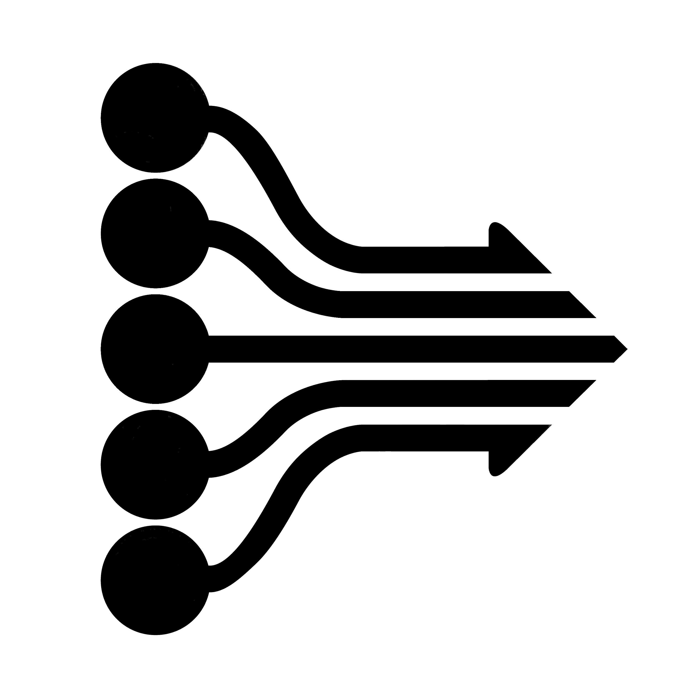
```

```{r out.width="20%"}
knitr::include_graphics("media/emo_change.png")
```

```{r out.width="20%"}
knitr::include_graphics("media/emo_behaviour.png")
```

```{r out.width="20%"}

```

```{r out.width="20%"}
knitr::include_graphics("media/emo_rapidity.png")
```

.center.tiny[Adapted from Scherer (2005) [`r emo::ji("link")`](https://doi.org/10.1177/0539018405058216)]

]

.right-column[

]

--

.large[Event Focus]

--

.large[Appraisal Driven]

--

.large[Response Synchronisation]

--

.large[Rapidity of Change]

--

.large[Behavioural Impact]

--

.large[Intense Response]

--

.large[Short Duration]

---

# Affective Computing

Research on emotions have lead to a "conceptual and definitional chaos" ([Buck, 1990, p. 330](https://doi.org/10.1207/s15327965pli0104_15)):

* There is still no consensual agreement between researchers
* Some assumptions of the broad audience are not supported by scientific evidences

.pull-left[
However, multiple tools and databases have been developed to investigate emotions. With the **increase in computer processing power** and the **development of machine learning algorithm**, computer scientists have created models to automatically recognize emotions... 

**What Could Possibly Go Wrong?**
]

.pull-right[
```{r out.width="80%"}
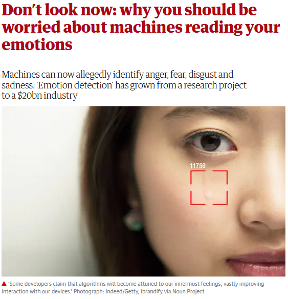
```
.center.tiny[Credit: The Guardian (2019) [`r emo::ji("link")`](https://www.theguardian.com/technology/2019/mar/06/facial-recognition-software-emotional-science)]
]

---

# Automatic Expression Recognition

Development of the technology:

* First attempt by reported by [Suwa, Sugie, & Fujimura (1978)](https://books.google.ie/books?id=P4s-AQAAIAAJ)
* Numerous academic systems since (see revue by [Zeng, Pantic, Roisman, & Huang, 2009]())
* VicarVision to develop the first commercial automatic classifier ([den Uyl & van Kuilenburg, 2005](http://www.vicarvision.nl/pub/fc_denuyl_and_vankuilenburg_2005.pdf))
* Today more than 20 companies for applications to automotive, sport, health, human resources, security or marketing purposes ([Dupré, Andelic, Morrison, & McKeown, 2018](https://doi.org/10.1109/PERCOMW.2018.8480127))

.pull-left[
A process in 3 steps:

* Face Detection
* Facial Landmark Detection
* Classification

Result is a recognition probability for a labelled category (e.g., Action Unit, Basic Emotion, Dimensions)
]

.pull-right[
```{r out.width="70%"}
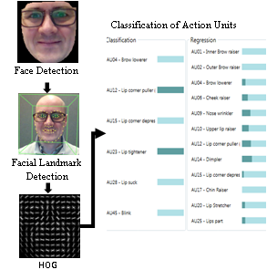
```
.center.tiny[Credit: Dupré, Andelic, Morrison & McKeown (2018) [`r emo::ji("link")`](https://doi.org/10.1109/PERCOMW.2018.8480127)]
]

---

# Facial Expression Categorization

Emotion categories/dimensions are inferred from facial expressions either:

.pull-left[
* Directly, by matching Action Units to prototypical expressions of emotions (Emotion coded by the FACS; [Ekman, Friesen, & Hager, 2002](https://www.paulekman.com/facial-action-coding-system/))

```{r out.width="85%"}
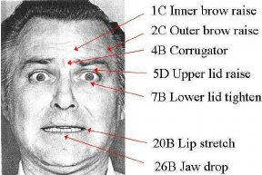
```
.center.tiny[Credit: Bartlett, Littlewort, Frank, Lainscsek, Fasel, & Movellan (2006) [`r emo::ji("link")`](https://www.doi.org/10.1109/FGR.2006.55)]

]

.pull-right[
* Indirectly, by generalizing features learnt from training with specific databases (pictures or video, posed or spontaneous)

```{r out.width="42%"}
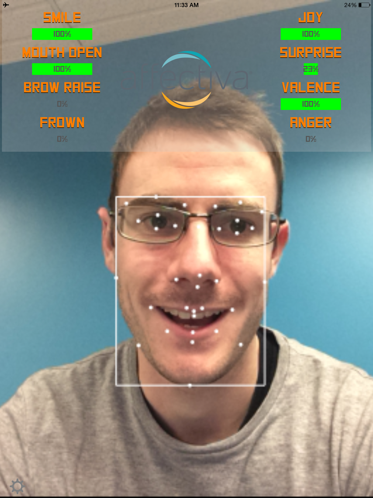
```
.center.tiny[Credit: ThinkApps [`r emo::ji("link")`](http://thinkapps.com/blog/development/machine-intelligence-affectiva-interview/)]

]

---

# Recognition Error

Automation facial expression recognition algorithms are designed to infer emotions in a controlled laboratory setting.

They may not be accurate once applied to the real world or to different context.

--

.pull-left[
Face recognition depends on:
.small[
- Face orientation (e.g., inclination, rotation)
- Face features (e.g., glasses, beard, face mask)
- Context light
- Morphological facial configurations
]

```{r out.width="100%"}
knitr::include_graphics("media/interstellar_affdex.gif")
```
.center.tiny[Interstellar by Affdex. Credit: Affectiva [`r emo::ji("link")`](https://www.youtube.com/watch?v=NsmAldoVwDs)]

]

---

# No Accuracy Standard

The precision of devices is not monitored and no standard provides safe guards to users:

.pull-left[

* According a benchmark of 8 commercially available systems, the accuracy of automatic classifiers of facial expressions varies between 48% and 62% compared to human observers ([Dupré, Krumhuber, Küster, & McKeown, 2020](https://doi.org/10.1371/journal.pone.0231968))

* The correlation between self-reported emotions and emotions inferred from automatic facial expression recognition is only $r = .12$ ([Tcherkassof & Dupré, 2021](https://doi.org/10.17605/OSF.IO/ERUA5))
]

.pull-right[
```{r out.width="100%"}
# tweetrmd::tweet_screenshot(
#   tweetrmd::tweet_url("AI__TECH", "1255878089986338816"),
#   maxwidth = 300,
#   hide_media = FALSE,
#   theme = "dark"
#   )

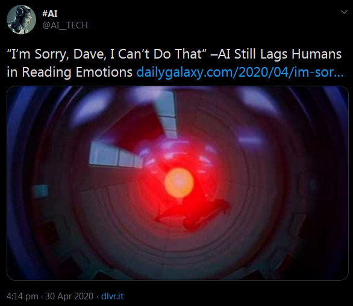
```
]

---

# Limitations of WEIRD Databases

Lack of diversity when using facial expression databases with Western/White, Educated, Industrialized, Rich, and Democratic participants ([Arnett, 2008](https://doi.org/10.1037/0003-066X.63.7.602); [Raji & Buolamwini, 2019](https://doi.org/10.1145/3306618.3314244)).

Factors influencing the accuracy to recognize emotion (e.g., [Bryant & Howard, 2019](https://doi.org/10.1145/3306618.3314284); [Rhue, 2018](http://dx.doi.org/10.2139/ssrn.3281765)):
- Identity
- Gender
- Ethnicity
- Age

> *"While most users will get a spot-on result, we acknowledge that the ethnicity classifiers currently offered (Black, White, Asian, Hispanic, ‘Other’) fall short of representing the richly diverse and rapidly evolving tapestry of culture and race."* - [Brackeen (2017)](https://www.kairos.com/blog/we-ve-retired-our-diversity-recognition-app-here-s-why)

---

# Prototypical Expressions

Both facial expressions and physiological rhythms are proxies to infer emotions **based on theoretical assumptions**

.pull-left[
In the case of facial expressions, a majority of databases used to train automatic classifiers considers:
.small[
- Six emotions are universal (happiness, surprise, sadness, disgust, fear, anger)
- These 6 emotions have prototypical representations
]

As a result, automatic classifiers cannot recognize the diversity of facial expressions:
.small[
- More than 6 categories of facial expressions
- Difficulty to identify subtle and mixed expressions
]

]

.pull-right[
```{r out.width="100%"}
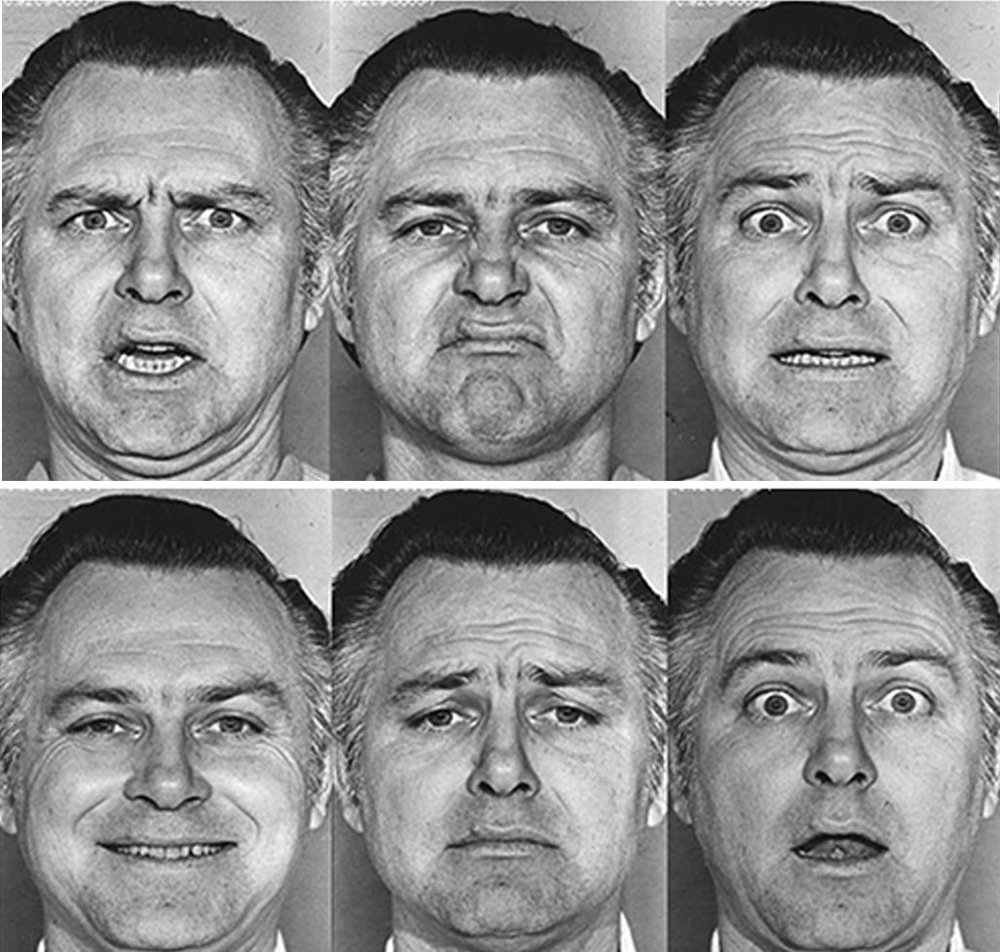
```
.center.tiny[Credit: Ekman, Friesen, & Hager (2002) [`r emo::ji("link")`](https://www.paulekman.com/facial-action-coding-system/)]
]

---

# Meaning is Context Dependent

A same facial expression can be interpreted differently according to the context in which the expression is produced

Examples of athletes' victory (e.g., raging or crying after wining; see [Martinez, 2019](https://doi.org/10.1073/pnas.1902661116))

```{r out.width="100%", fig.cap=""}
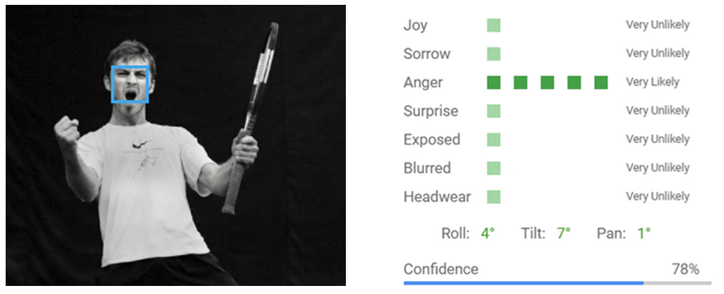
```
.center.tiny[Emotion recognized as 'Anger' but the context reveals an experience closer to 'Intense Joy'.]

---

# Absence of Scientific Support

Despite the development of automatic classifiers on the idea that emotional categories can be inferred from sensors, there is **no scientific evidence** of reliable expressive and physiological patterns corresponding to emotional categories:

.pull-left[
* No one-to-one mapping between patterns and categories ([Kappas, 2003](https://doi.org/10.1007/978-1-4615-1063-5_11))
* Facial expression often communicates something other than an emotional state ([Barrett, Adolphs, Marsella, Martinez, & Pollak, 2019](https://doi.org/10.1177/1529100619832930))
]

.pull-right[
```{r out.width="100%"}
# tweetrmd::tweet_screenshot(
#   tweetrmd::tweet_url("truthbegolduk", "1152169980722655232"),
#   maxwidth = 400,
#   hide_media = FALSE,
#   theme = "dark"
#   )
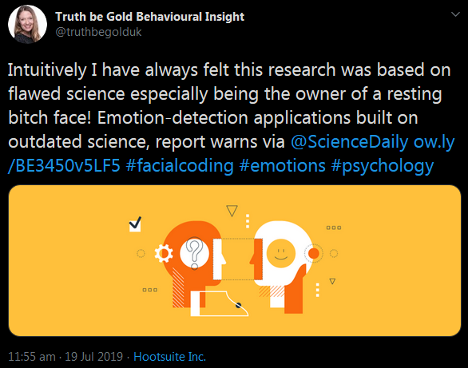
```
]

---

# Current Challenges

With regard to what has been said, we have two problems here, and data/emotion privacy is not one of them:

.pull-left[

1. Expressive measures are prone to errors

2. Models used by automatic classifiers to categorise emotions are not reliable

Therefore, **should we use these automatic classifiers?**

> *"Regulators should ban the use of affect recognition in important decisions that impact people's lives and access to opportunities. Until then, AI companies should stop deploying it."* - [AI Now Institute (2019)](https://ainowinstitute.org/AI_Now_2019_Report.html)

]

.pull-right[
```{r out.width="80%"}
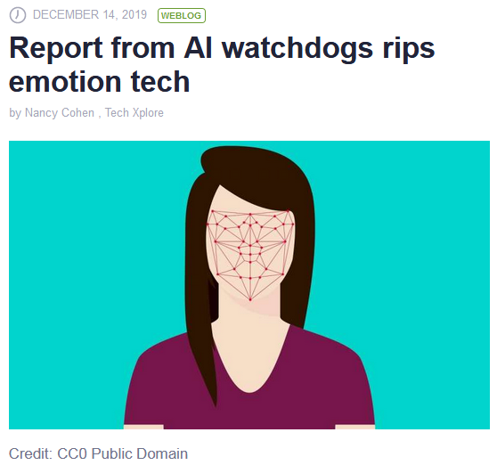
```
.center.tiny[Credit: Tech Xplore (2019) [`r emo::ji("link")`](https://techxplore.com/news/2019-12-ai-watchdogs-rips-emotion-tech.html)]
]

---

# Future Directions

Most of automatic classifiers of facial expressions have already moved from a classification in categories to a classification in dimensions such as Valence/Pleasure and Arousal/Activation:

* More reliable scientific evidences for a dimensional perspective
* Not restricted to specific patterns

.pull-left[
Additionally, errors in face and physiological measures are reducing with improved techniques and materials.

> *"All models are wrong, but some are useful"* - [Box (1979)](https://doi.org/10.1016/B978-0-12-438150-6.50018-2)

]
.pull-right[
```{r out.width="100%"}
# tweetrmd::tweet_screenshot(
#   tweetrmd::tweet_url("DigitalTrends", "1184388139395108864"),
#   maxwidth = 400,
#   hide_media = FALSE,
#   theme = "dark"
#   )

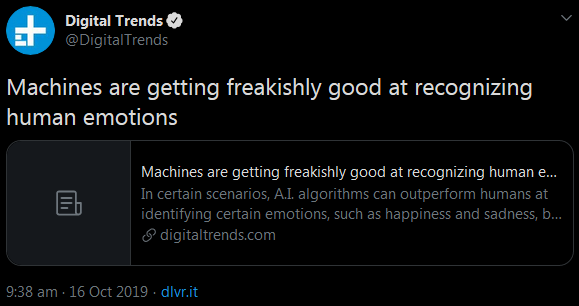
```
]

---
class: inverse, mline, left, middle


# Thanks for your attention, find me at...

[`r fa(name = "twitter")` @damien_dupre](http://twitter.com/damien_dupre)  
[`r fa(name = "github")` @damien-dupre](http://github.com/damien-dupre)  
[`r fa(name = "link")` damien-datasci-blog.netlify.app](https://damien-datasci-blog.netlify.app)  
[`r fa(name = "paper-plane")` damien.dupre@dcu.ie](mailto:damien.dupre@dcu.ie)